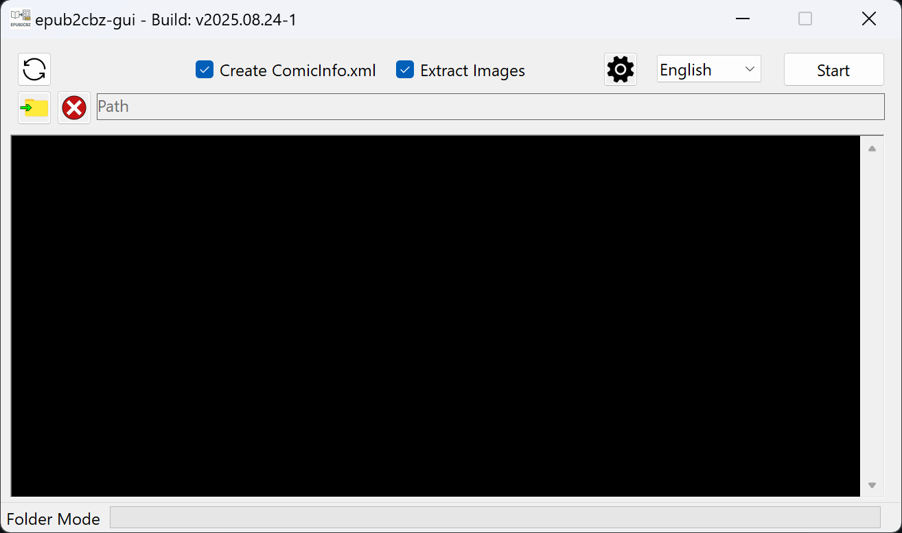

# epub2cbz
C# program to extract .epub Manga and Comic ebooks into .cbz files, including a ComicInfo.xml file with chapter info, reading direction and more.  

## Prerequisites
- Epubs must be DRM-free and should ideally be in the format of "[Series] v[Volume].epub", for example "Two Pieces v69.epub" (both are optional, but are derived from the filename, if calibre tags are not found)
- If you download the smaller package (without "_full" in the filename), you need to install [.NET Desktop Runtime 9](https://dotnet.microsoft.com/download/dotnet/9.0). The program should guide you to the correct website, if it isn't installed yet.

## How to
- Start the epub2cbz.exe
- If in Folder Mode, click on the "Input Folder" button (📁) and select the folder containing the epub files
- If in File Mode, drag and drop the epub files onto the main text window and optionally select an "Output Folder" (📁)
- (Click on the mode switch button (🔄) to switch between these two modes)
- Enable or disable certain options, like creating a ComicInfo.xml file or extracting images. The settings menu (⚙) contains more options (recommended settings are enabled by default)
- Click the "Start" button and wait 

## Command Line Arguments
- "--simple" / "-s": Enable "Simple Mode". Only extracts images. No further processing is done. All images keep their original name. Very Fast!
- "--dark" / "-d": Enable dark mode
  

## Build from Source
Download and install the [.NET SDK 9.0](https://dotnet.microsoft.com/en-us/download) then either run the "publish_full.bat" or "publish_small.bat" in the source folder

## Need Help?
Getting error messages or something isn't working as expected? 
Please don't hesitate to open an Issue or contact me directly. 

Twitter/X: [@af_Seb](https://x.com/af_Seb) 
Bluesky: [@afseb.bsky.social](https://bsky.app/profile/afseb.bsky.social) 
Mastodon: [@af_Seb@social.cologne](https://social.cologne/@af_Seb) 

## Licenses
epub2cbz uses the following third party software libraries:

| Library | Usage | License |
| --- | --- | --- |
| [CoenM.ImageSharp.ImageHash](https://github.com/coenm/ImageHash) | Comparing duplicate cover candidates | [MIT](https://licenses.nuget.org/MIT) |
| [ExCSS](https://github.com/TylerBrinks/ExCSS) | Parsing info from CSS files | [MIT](https://licenses.nuget.org/MIT) |
| [SixLabors.ImageSharp](https://github.com/SixLabors/ImageSharp) | Decoding WebP images | [Apache-2.0](https://licenses.nuget.org/Apache-2.0) |
| [SixLabors.ImageSharp.Drawing](https://github.com/SixLabors/ImageSharp.Drawing) | Creating blank images | [Apache-2.0](https://licenses.nuget.org/Apache-2.0) |
