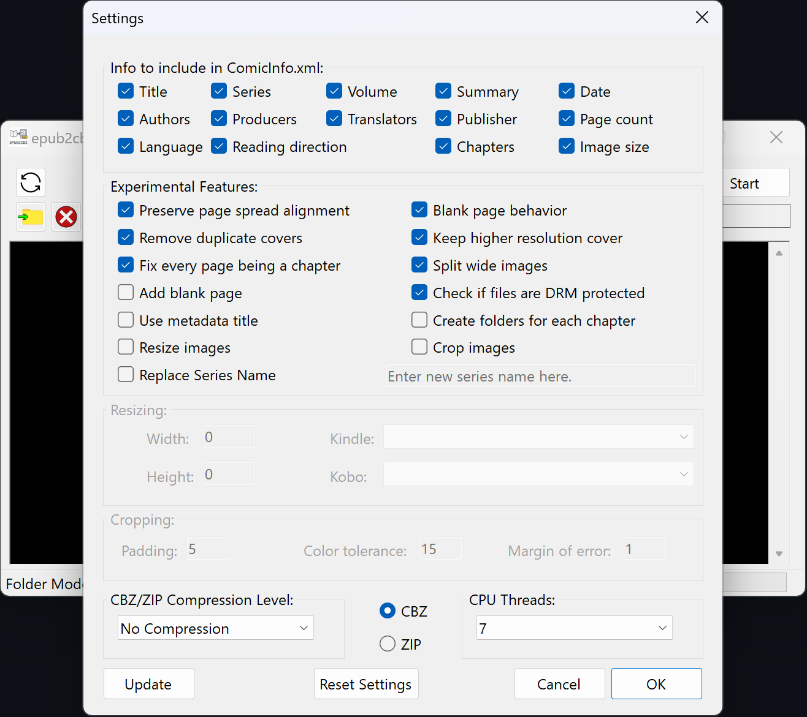

# epub2cbz-gui
C# program to extract .epub Manga and Comic ebooks into .cbz files, including a ComicInfo.xml file with chapter info, reading direction and more.  

## Prerequisites
- Epubs must be DRM-free and should ideally be in the format of "[Series] v[Volume].epub", for example "Two Pieces v69.epub" (both are optional, but are derived from the filename, if enabled)

## How to
- Move all to be converted .epub files into one folder (preferably an empty one)
- Start the epub2cbz-gui.exe
- Click on the "Folder" button and select the folder containing the epub files
- (If you only want to convert specific epub files, you can create a "mangalist.txt" file containing the names of the epub files you want to convert. One name per line. Put the mangalist.txt file into the same folder where your epubs files are and that you selected in the last step, then activate the "Use mangalist.txt" checkbox)
- Enable or disable certain options, like creating a ComicInfo.xml file or extracting images. The cogwheel contains more options (everything is enabled by default)
- Click the "Start" button and wait  

## Need Help?
Getting error messages or something isn't working as expected? 
Please don't hesitate to open an Issue or contact me directly. 

Twitter/X: [@af_Seb](https://x.com/af_Seb) 
Bluesky: [@afseb.bsky.social](https://bsky.app/profile/afseb.bsky.social) 
Mastodon: [@af_Seb@social.cologne](https://social.cologne/@af_Seb) 

## Licenses
epub2cbz-gui uses the following third party software libraries:

| Library | Usage | License |
| --- | --- | --- |
| [ExCSS](https://www.nuget.org/packages/ExCSS/) | Parsing info from CSS files | [MIT](https://licenses.nuget.org/MIT) |
| [SkiaSharp](https://www.nuget.org/packages/SkiaSharp/) | Creating blank images | [MIT](https://licenses.nuget.org/MIT) |
| [Topten.RichTextKit](https://www.nuget.org/packages/Topten.RichTextKit/) | Adding text to blank images (DEBUG Version only) | [Apache-2.0](https://licenses.nuget.org/Apache-2.0) |
